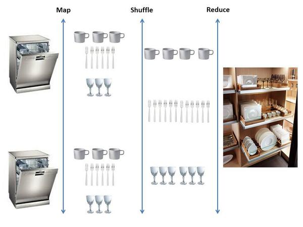

## Why go parallel?

* Bought a computer after 2010
* Poor coding skills
* Don't know C++
* C++ isn't enough

## Parallel in R

**Basics & tools**

1. MapReduce
2. Thinking lapply
3. Package: `parallel`
4. Package: `foreach`
5. Fork or sock?

**Trouble shooting**

1. Caching
2. Debugging in threads
3. Load balancing

## MapReduce - programming model

**Concept**

1. The Map - Map(k1,v1) --> list(k2,v2)
2. Shuffle
3. The Reduce - Reduce(k2, list (v2)) --> list(v3)

**Interpretation**

The Map calculates the basic core statistic.

The Reduce aggregates the statistic into what we want.

## MapReduce - Schematic {.flexbox .vcenter}



Curtesy of: http://gerardnico.com/wiki/algorithm/map_reduce

## Learning lapply

* Core R
* Simple
* Each element is independent

```{r}
lapply(1:3, function(x) c(x, x^2, x^3))
```

## Package: `parallel`

## Package: `foreach`

## Fork or sock?

**Fork**

Fork: "to divide in branches, go separate ways"<br />
System: Unix/Mac<br />
Environment: Link all

**PSOCK**

PSOCK: Parallel Socket Cluster<br />
System: Windows<br />
Environment: Empty

# Trouble shooting

## Debugging

Options:
* Setting makeCluster(..., outfile = "par_out.txt")

## Caching

**Save as you go**

1. Do a digest of settings + function
2. Check if file.exists()
3. Check if digests match

* R.cache

## Load balancing - workload

**parLapply under the hood**

```
function (cl = NULL, X, fun, ...) 
{
    cl <- defaultCluster(cl)
    do.call(c, clusterApply(cl, x = splitList(X, length(cl)), 
        fun = lapply, fun, ...), quote = TRUE)
}  
```

## Load balancing - memory

* memory.limit()/memory.size() = max cores
* remove any old copies through **rm()**
* force return memory through **gc()**
* try to do high-memory load parallel with low memory
* skip parallel if limit reached
