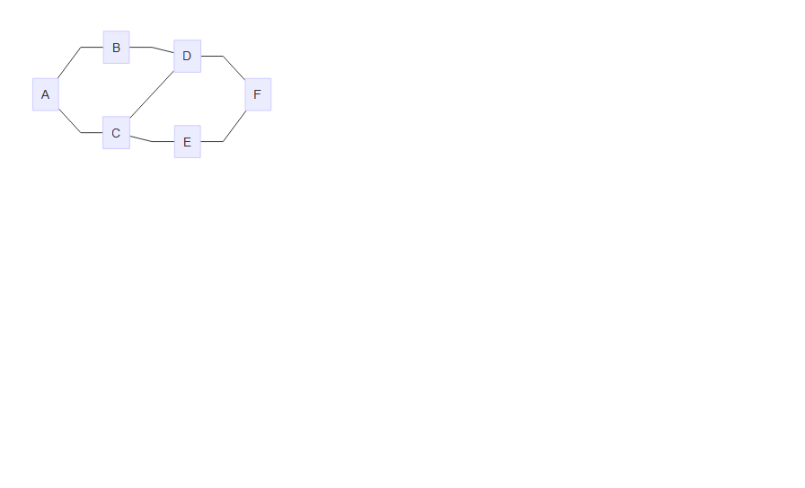
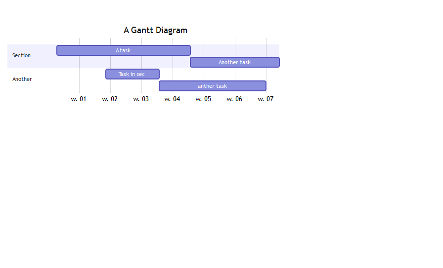

```{r echo=FALSE, message=FALSE}
knitr::opts_chunk$set(message = FALSE)
library(magrittr)
library(dplyr)
library(multidplyr)
library(htmlTable)
pkgs <- 
  readRDS("inc/package_downloads_2010-2015.RDS") %>% 
   mutate(time_yrs = time/365.25)
top_coders <-
  readRDS("inc/top_coders_2010_2015.RDS")
```


## What happened?

- Packages
- Big business
- Miscellaneous

## Still growing

```{r,echo=FALSE}
library(ggplot2)
fit <- 
  pkgs %>% 
  group_by(year) %>% 
  summarise(n = n()) %>% 
  mutate(year = as.numeric(year),
         year = year - min(year)) %>% 
  lm(n ~ year, data = .)

pkgs %>% 
  group_by(year) %>% 
  summarise(n = n()) %>% 
  ggplot(aes(x = year, y = n, fill = n)) +
  geom_bar(stat = "identity") +
  scale_fill_continuous(low = "#888888", high = "#BB2233") +
  scale_color_continuous(low = "#888888", high = "#000000") +
  ylab("Number of new packages") + 
  xlab("Year") + 
  geom_text(aes(x = 2, y=1600, 
                label=coef(fit)[2] %>% txtRound(0) %>% sprintf("Increases with %s per year", .)))

```

## Package dominance{.vcenter}

```{r, warning=FALSE, echo=FALSE}
library(quantreg)
lapply(c(.5, .75, .95, .99),
       function(tau){
         rq_fit <- rq(avg ~ time_yrs, data = pkgs, tau = tau)
         rq_sum <- summary(rq_fit)
         digits = ifelse(rq_sum$coefficients[2, 1] > 100, 0,1)
         with(rq_sum,{
           c(Estimate = txtRound(coefficients[2, 1], digits), 
             `95% CI` = txtRound(coefficients[2, 1] + 
                                    c(-1, 1) * coefficients[2, 2], digits) %>% 
               
             paste(collapse = " to "))
         })
       }) %>% 
  do.call(rbind, .) %>% 
  htmlTable(rnames = c("Median",
                       "Upper quartile",
                       "Top 5%",
                       "Top 1%"))
```

## Biggest package trends

<div class="columns-2">
**2015**

1. xml2 (Hadley)
2. rversions
3. git2r (Stefan W.)
4. ...
5. DiagrammeR
6. DT


**2012-2013**

1. knitr
2. dplyr
3. shiny
4. stringi/stringr
5. R6
</div>

## Major themes

- web
- graphics
- package building blocks

## xml2{.smaller}

Author: Hadley

<div class="columns-2">
```{r xml2}
library("xml2")
txt <- 
"<foo> 
  <bar> text <baz/> 
  </bar>
</foo>"
x <- read_xml(txt)
x

xml_children(x)

xml_find_all(x, "//baz")
```
</div>

## rversions{.smaller}

Author: Csardi & Ooms

```{r rversions}
library(rversions)
r_release()

r_versions() %>% 
  tail
```

## git2r{.smaller}

Author: Stefan Widgren

```{r git2r}
library(git2r)
repo <- init(".")
commits(repo) %>% 
  head(3)
```

## DiagrammeR

Author: Iannone, Sveidqvist, Bostock, Pettitt, Daines, Kashcha, Iannone

<div class="columns-2">
```{r DiagrammeR, results='asis', eval=FALSE}
library(DiagrammeR)
DiagrammeR("
  graph LR
    A-->B
    A-->C
    C-->E
    B-->D
    C-->D
    D-->F
    E-->F
", height = 200, width = 400)
```

</div>

## Diagrammer continued{.smaller}

```{r Diagrammer_part2, results='asis', message=FALSE, eval=FALSE}
DiagrammeR::mermaid("
gantt
    title A Gantt Diagram

    section Section
    A task           :a1, 2014-01-01, 30d
    Another task     :after a1  , 20d
    section Another
    Task in sec      :2014-01-12  , 12d
    anther task      : 24d
", width = 600, height = 250)
```



## Top codeRs 2015{.smaller}

```{r echo=FALSE}
htmlTable(
  top_coders[[1]] %>% 
    mutate(download_ave = txtInt(download_ave)),
  align = "lrr",
  header = c("Coder", "Total ave. downloads per day", "No. of packages"),
  caption = c("Top coders 2015"),
  col.rgroup = c("white", "#F0F0FF"))
```

Gabor Csardi - Harvard (rversions)
Jeroen Ooms - UCLA (xml2)
Richard Cotton - Live Analytics (assertive)

## Top codeRs 2010-2015{.smallest}
```{r echo=FALSE}
htmlTable(
  top_coders[[2]] %>% 
    mutate(download_ave = txtInt(download_ave)),
  align = "lrr",
  header = c("Coder", "Total ave. downloads per day", "No. of packages"),
  caption = c("Top coders 2010-2015"),
  col.rgroup = c("white", "#F0F0FF"))
```

## The R-consortium

Chair: **Hadley W.**

From the about page:

* Create infrastructure and standards to benefit all
* Promote the R language in industry, academia, and government.
* Create and promote best practices.

Members: Microsoft, RStudio, TIBC, Google, HP, Oracle, ...

## R-Hub

*R-Hub will modernize and improve the entire process of developing and testing R packages*

### Goals

1. Services that ease all steps the R package development process, creating a package, building binaries and continuous integration, publishing, distributing and maintaining it.
2. Make these services free for all members of the community.
3. Allow community contributions to r-hub itself.
4. Make CRAN maintainers' work easier by pre-testing CRAN package submissions.

## My own experience

* dplyr changed my life
* dear magrittr, I just can't live without you
* flexsurv I can actually explain to my colleagues...

