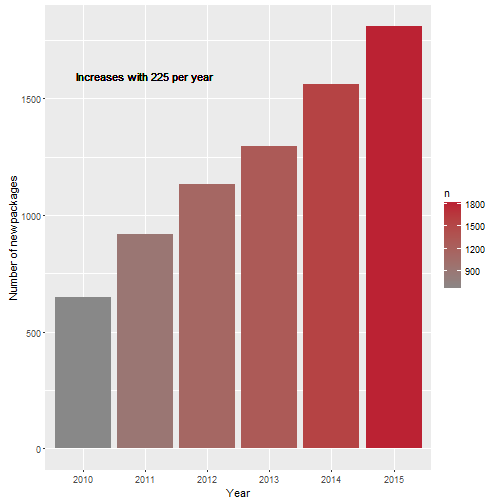
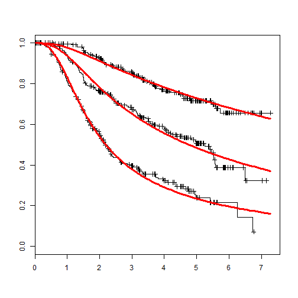
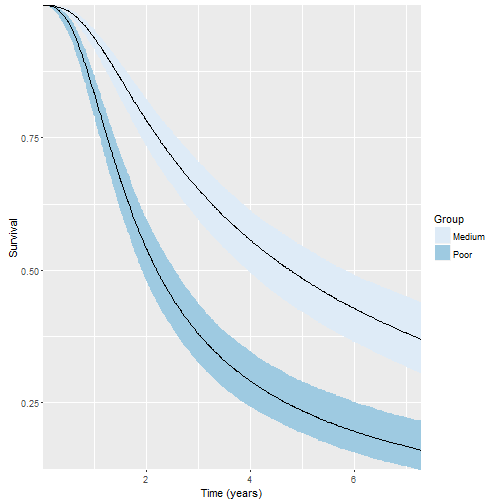

<style>
.small-code pre code {
  font-size: 1em;
}
.smaller-code pre code {
  font-size: .8em;
}
.footer {
    color: black; background: #E8E8E8;
    position: fixed; top: 90%;
    text-align:center; width:100%;
}
</style>

R trends in 2015
========================================================
author: "Max Gordon"
date: 16 February 2016


What happened?
========================================================

- Packages
- Big business
- Miscellaneous


Still growing
========================================================



Package dominance
========================================================

<table class='gmisc_table' style='border-collapse: collapse; margin-top: 1em; margin-bottom: 1em;' >
<thead>
<tr>
<th style='border-bottom: 1px solid grey; border-top: 2px solid grey;'> </th>
<th style='border-bottom: 1px solid grey; border-top: 2px solid grey; text-align: center;'>Estimate</th>
<th style='border-bottom: 1px solid grey; border-top: 2px solid grey; text-align: center;'>95% CI</th>
</tr>
</thead>
<tbody>
<tr>
<td style='text-align: left;'>Median</td>
<td style='text-align: center;'>0.6</td>
<td style='text-align: center;'>0.6 to 0.6</td>
</tr>
<tr>
<td style='text-align: left;'>Upper quartile</td>
<td style='text-align: center;'>1.2</td>
<td style='text-align: center;'>1.1 to 1.2</td>
</tr>
<tr>
<td style='text-align: left;'>Top 5%</td>
<td style='text-align: center;'>9.9</td>
<td style='text-align: center;'>8.9 to 10.9</td>
</tr>
<tr>
<td style='border-bottom: 2px solid grey; text-align: left;'>Top 1%</td>
<td style='border-bottom: 2px solid grey; text-align: center;'>182</td>
<td style='border-bottom: 2px solid grey; text-align: center;'>139 to 225</td>
</tr>
</tbody>
</table>

Biggest package trends
========================================================

**2015**

1. xml2 (Hadley)
2. rversions
3. git2r (Stefan W.)
4. ...
5. DiagrammeR
6. DT

***

**2012-2013**

1. knitr
2. dplyr
3. shiny
4. stringi/stringr
5. R6

Major themes
========================================================

- Web
- Graphics
- Package building blocks

xml2
========================================================
class: small-code

Author: Hadley


```r
library("xml2")
txt <- 
"<foo> 
  <bar> text <baz/> 
  </bar>
</foo>"
x <- read_xml(txt)
x
```

```
{xml_document}
<foo>
[1] <bar> text <baz/> \n  </bar>
```
***

```r
xml_children(x)
```

```
{xml_nodeset (1)}
[1] <bar> text <baz/> \n  </bar>
```

```r
xml_find_all(x, "//baz")
```

```
{xml_nodeset (1)}
[1] <baz/>
```

rversions
========================================================
class: small-code

Author: Csardi & Ooms


```r
library(rversions)
r_release()
```

```
   version                        date
97   3.2.3 2015-12-10T08:13:08.415370Z
```


```r
r_versions() %>% 
  tail
```

```
   version                        date
92   3.1.2 2014-10-31T08:11:32.082768Z
93   3.1.3 2015-03-09T08:12:20.229070Z
94   3.2.0 2015-04-16T07:13:33.144514Z
95   3.2.1 2015-06-18T07:15:04.589869Z
96   3.2.2 2015-08-14T07:13:18.272871Z
97   3.2.3 2015-12-10T08:13:08.415370Z
```

<div class="footer" style="margin-top:0px;font-size:80%;">
Used by the devtools package
</div>

git2r
========================================================
class: small-code

Author: Stefan Widgren


```r
library(git2r)
repo <- init(".")
commits(repo) %>% 
  head(3)
```

```
[[1]]
[024ad5f] 2016-02-15: Added top charts

[[2]]
[fc5fa42] 2016-02-14: Started working on R-trend presentation

[[3]]
[d51d5dd] 2015-02-15: Added the try-catch approach
```

DiagrammeR
========================================================
class: small-code

Author: Iannone, Sveidqvist, Bostock, Pettitt, Daines, Kashcha, Iannone


```r
library(DiagrammeR)
DiagrammeR("
  graph LR
    A-->B
    A-->C
    C-->E
    B-->D
    C-->D
    D-->F
    E-->F
", height = 200, width = 400)
```

***


Diagrammer continued
========================================================
class: small-code


```r
DiagrammeR::mermaid("
gantt
    title A Gantt Diagram

    section Section
    A task           :a1, 2014-01-01, 30d
    Another task     :after a1  , 20d
    section Another
    Task in sec      :2014-01-12  , 12d
    anther task      : 24d
", width = 600, height = 250)
```


Top codeRs 2015
========================================================

<table class='gmisc_table' style='border-collapse: collapse; margin-top: 1em; margin-bottom: 1em;' >
<thead>
<tr>
<th style='border-bottom: 1px solid grey; border-top: 2px solid grey;'> </th>
<th style='border-bottom: 1px solid grey; border-top: 2px solid grey; text-align: center;'>Coder</th>
<th style='border-bottom: 1px solid grey; border-top: 2px solid grey; text-align: center;'>Total ave. downloads per day</th>
<th style='border-bottom: 1px solid grey; border-top: 2px solid grey; text-align: center;'>No. of packages</th>
</tr>
</thead>
<tbody>
<tr style='background-color: #ffffff;'>
<td style='background-color: #ffffff; text-align: left;'>1</td>
<td style='background-color: #ffffff; text-align: left;'>Gabor Csardi</td>
<td style='background-color: #ffffff; text-align: right;'>2,312</td>
<td style='background-color: #ffffff; text-align: right;'>11</td>
</tr>
<tr style='background-color: #f0f0ff;'>
<td style='background-color: #f0f0ff; text-align: left;'>2</td>
<td style='background-color: #f0f0ff; text-align: left;'>Stefan Widgren</td>
<td style='background-color: #f0f0ff; text-align: right;'>1,563</td>
<td style='background-color: #f0f0ff; text-align: right;'>1</td>
</tr>
<tr style='background-color: #ffffff;'>
<td style='background-color: #ffffff; text-align: left;'>3</td>
<td style='background-color: #ffffff; text-align: left;'>RStudio</td>
<td style='background-color: #ffffff; text-align: right;'>781</td>
<td style='background-color: #ffffff; text-align: right;'>16</td>
</tr>
<tr style='background-color: #f0f0ff;'>
<td style='background-color: #f0f0ff; text-align: left;'>4</td>
<td style='background-color: #f0f0ff; text-align: left;'>Hadley Wickham</td>
<td style='background-color: #f0f0ff; text-align: right;'>695</td>
<td style='background-color: #f0f0ff; text-align: right;'>12</td>
</tr>
<tr style='background-color: #ffffff;'>
<td style='background-color: #ffffff; text-align: left;'>5</td>
<td style='background-color: #ffffff; text-align: left;'>Jeroen Ooms</td>
<td style='background-color: #ffffff; text-align: right;'>541</td>
<td style='background-color: #ffffff; text-align: right;'>10</td>
</tr>
<tr style='background-color: #f0f0ff;'>
<td style='background-color: #f0f0ff; text-align: left;'>6</td>
<td style='background-color: #f0f0ff; text-align: left;'>Richard Cotton</td>
<td style='background-color: #f0f0ff; text-align: right;'>501</td>
<td style='background-color: #f0f0ff; text-align: right;'>22</td>
</tr>
<tr style='background-color: #ffffff;'>
<td style='background-color: #ffffff; text-align: left;'>7</td>
<td style='background-color: #ffffff; text-align: left;'>R Foundation</td>
<td style='background-color: #ffffff; text-align: right;'>490</td>
<td style='background-color: #ffffff; text-align: right;'>1</td>
</tr>
<tr style='background-color: #f0f0ff;'>
<td style='background-color: #f0f0ff; text-align: left;'>8</td>
<td style='background-color: #f0f0ff; text-align: left;'>David Hoerl</td>
<td style='background-color: #f0f0ff; text-align: right;'>455</td>
<td style='background-color: #f0f0ff; text-align: right;'>1</td>
</tr>
<tr style='background-color: #ffffff;'>
<td style='background-color: #ffffff; text-align: left;'>9</td>
<td style='background-color: #ffffff; text-align: left;'>Sindre Sorhus</td>
<td style='background-color: #ffffff; text-align: right;'>409</td>
<td style='background-color: #ffffff; text-align: right;'>2</td>
</tr>
<tr style='background-color: #f0f0ff;'>
<td style='background-color: #f0f0ff; border-bottom: 2px solid grey; text-align: left;'>10</td>
<td style='background-color: #f0f0ff; border-bottom: 2px solid grey; text-align: left;'>Richard Iannone</td>
<td style='background-color: #f0f0ff; border-bottom: 2px solid grey; text-align: right;'>294</td>
<td style='background-color: #f0f0ff; border-bottom: 2px solid grey; text-align: right;'>2</td>
</tr>
</tbody>
</table>

- Gabor Csardi - Harvard (rversions)
- Jeroen Ooms - UCLA (xml2)
- Richard Cotton - Live Analytics (assertive)

Top codeRs 2010-2015
========================================================

<table class='gmisc_table' style='border-collapse: collapse; margin-top: 1em; margin-bottom: 1em;' >
<thead>
<tr>
<th style='border-bottom: 1px solid grey; border-top: 2px solid grey;'> </th>
<th style='border-bottom: 1px solid grey; border-top: 2px solid grey; text-align: center;'>Coder</th>
<th style='border-bottom: 1px solid grey; border-top: 2px solid grey; text-align: center;'>Total ave. downloads per day</th>
<th style='border-bottom: 1px solid grey; border-top: 2px solid grey; text-align: center;'>No. of packages</th>
</tr>
</thead>
<tbody>
<tr style='background-color: #ffffff;'>
<td style='background-color: #ffffff; text-align: left;'>1</td>
<td style='background-color: #ffffff; text-align: left;'>Hadley Wickham</td>
<td style='background-color: #ffffff; text-align: right;'>32,115</td>
<td style='background-color: #ffffff; text-align: right;'>55</td>
</tr>
<tr style='background-color: #f0f0ff;'>
<td style='background-color: #f0f0ff; text-align: left;'>2</td>
<td style='background-color: #f0f0ff; text-align: left;'>Yihui Xie</td>
<td style='background-color: #f0f0ff; text-align: right;'>9,739</td>
<td style='background-color: #f0f0ff; text-align: right;'>18</td>
</tr>
<tr style='background-color: #ffffff;'>
<td style='background-color: #ffffff; text-align: left;'>3</td>
<td style='background-color: #ffffff; text-align: left;'>RStudio</td>
<td style='background-color: #ffffff; text-align: right;'>9,123</td>
<td style='background-color: #ffffff; text-align: right;'>25</td>
</tr>
<tr style='background-color: #f0f0ff;'>
<td style='background-color: #f0f0ff; text-align: left;'>4</td>
<td style='background-color: #f0f0ff; text-align: left;'>Jeroen Ooms</td>
<td style='background-color: #f0f0ff; text-align: right;'>4,221</td>
<td style='background-color: #f0f0ff; text-align: right;'>25</td>
</tr>
<tr style='background-color: #ffffff;'>
<td style='background-color: #ffffff; text-align: left;'>5</td>
<td style='background-color: #ffffff; text-align: left;'>Justin Talbot</td>
<td style='background-color: #ffffff; text-align: right;'>3,633</td>
<td style='background-color: #ffffff; text-align: right;'>1</td>
</tr>
<tr style='background-color: #f0f0ff;'>
<td style='background-color: #f0f0ff; text-align: left;'>6</td>
<td style='background-color: #f0f0ff; text-align: left;'>Winston Chang</td>
<td style='background-color: #f0f0ff; text-align: right;'>3,531</td>
<td style='background-color: #f0f0ff; text-align: right;'>17</td>
</tr>
<tr style='background-color: #ffffff;'>
<td style='background-color: #ffffff; text-align: left;'>7</td>
<td style='background-color: #ffffff; text-align: left;'>Gabor Csardi</td>
<td style='background-color: #ffffff; text-align: right;'>3,437</td>
<td style='background-color: #ffffff; text-align: right;'>26</td>
</tr>
<tr style='background-color: #f0f0ff;'>
<td style='background-color: #f0f0ff; text-align: left;'>8</td>
<td style='background-color: #f0f0ff; text-align: left;'>Romain Francois</td>
<td style='background-color: #f0f0ff; text-align: right;'>2,934</td>
<td style='background-color: #f0f0ff; text-align: right;'>20</td>
</tr>
<tr style='background-color: #ffffff;'>
<td style='background-color: #ffffff; text-align: left;'>9</td>
<td style='background-color: #ffffff; text-align: left;'>Duncan Temple Lang</td>
<td style='background-color: #ffffff; text-align: right;'>2,854</td>
<td style='background-color: #ffffff; text-align: right;'>6</td>
</tr>
<tr style='background-color: #f0f0ff;'>
<td style='background-color: #f0f0ff; text-align: left;'>10</td>
<td style='background-color: #f0f0ff; text-align: left;'>Adrian A. Dragulescu</td>
<td style='background-color: #f0f0ff; text-align: right;'>2,456</td>
<td style='background-color: #f0f0ff; text-align: right;'>2</td>
</tr>
<tr style='background-color: #ffffff;'>
<td style='background-color: #ffffff; text-align: left;'>11</td>
<td style='background-color: #ffffff; text-align: left;'>JJ Allaire</td>
<td style='background-color: #ffffff; text-align: right;'>2,453</td>
<td style='background-color: #ffffff; text-align: right;'>7</td>
</tr>
<tr style='background-color: #f0f0ff;'>
<td style='background-color: #f0f0ff; text-align: left;'>12</td>
<td style='background-color: #f0f0ff; text-align: left;'>Simon Urbanek</td>
<td style='background-color: #f0f0ff; text-align: right;'>2,369</td>
<td style='background-color: #f0f0ff; text-align: right;'>15</td>
</tr>
<tr style='background-color: #ffffff;'>
<td style='background-color: #ffffff; text-align: left;'>13</td>
<td style='background-color: #ffffff; text-align: left;'>Dirk Eddelbuettel</td>
<td style='background-color: #ffffff; text-align: right;'>2,094</td>
<td style='background-color: #ffffff; text-align: right;'>33</td>
</tr>
<tr style='background-color: #f0f0ff;'>
<td style='background-color: #f0f0ff; text-align: left;'>14</td>
<td style='background-color: #f0f0ff; text-align: left;'>Stefan Milton Bache</td>
<td style='background-color: #f0f0ff; text-align: right;'>2,069</td>
<td style='background-color: #f0f0ff; text-align: right;'>3</td>
</tr>
<tr style='background-color: #ffffff;'>
<td style='background-color: #ffffff; text-align: left;'>15</td>
<td style='background-color: #ffffff; text-align: left;'>Douglas Bates</td>
<td style='background-color: #ffffff; text-align: right;'>1,966</td>
<td style='background-color: #ffffff; text-align: right;'>5</td>
</tr>
<tr style='background-color: #f0f0ff;'>
<td style='background-color: #f0f0ff; text-align: left;'>16</td>
<td style='background-color: #f0f0ff; text-align: left;'>Renaud Gaujoux</td>
<td style='background-color: #f0f0ff; text-align: right;'>1,962</td>
<td style='background-color: #f0f0ff; text-align: right;'>6</td>
</tr>
<tr style='background-color: #ffffff;'>
<td style='background-color: #ffffff; text-align: left;'>17</td>
<td style='background-color: #ffffff; text-align: left;'>Jelmer Ypma</td>
<td style='background-color: #ffffff; text-align: right;'>1,933</td>
<td style='background-color: #ffffff; text-align: right;'>2</td>
</tr>
<tr style='background-color: #f0f0ff;'>
<td style='background-color: #f0f0ff; text-align: left;'>18</td>
<td style='background-color: #f0f0ff; text-align: left;'>Rob J Hyndman</td>
<td style='background-color: #f0f0ff; text-align: right;'>1,933</td>
<td style='background-color: #f0f0ff; text-align: right;'>3</td>
</tr>
<tr style='background-color: #ffffff;'>
<td style='background-color: #ffffff; text-align: left;'>19</td>
<td style='background-color: #ffffff; text-align: left;'>Baptiste Auguie</td>
<td style='background-color: #ffffff; text-align: right;'>1,924</td>
<td style='background-color: #ffffff; text-align: right;'>2</td>
</tr>
<tr style='background-color: #f0f0ff;'>
<td style='background-color: #f0f0ff; text-align: left;'>20</td>
<td style='background-color: #f0f0ff; text-align: left;'>Ulrich Halekoh Søren Højsgaard</td>
<td style='background-color: #f0f0ff; text-align: right;'>1,764</td>
<td style='background-color: #f0f0ff; text-align: right;'>1</td>
</tr>
<tr style='background-color: #ffffff;'>
<td style='background-color: #ffffff; text-align: left;'>21</td>
<td style='background-color: #ffffff; text-align: left;'>Martin Maechler</td>
<td style='background-color: #ffffff; text-align: right;'>1,682</td>
<td style='background-color: #ffffff; text-align: right;'>11</td>
</tr>
<tr style='background-color: #f0f0ff;'>
<td style='background-color: #f0f0ff; text-align: left;'>22</td>
<td style='background-color: #f0f0ff; text-align: left;'>Mirai Solutions GmbH</td>
<td style='background-color: #f0f0ff; text-align: right;'>1,603</td>
<td style='background-color: #f0f0ff; text-align: right;'>3</td>
</tr>
<tr style='background-color: #ffffff;'>
<td style='background-color: #ffffff; text-align: left;'>23</td>
<td style='background-color: #ffffff; text-align: left;'>Stefan Widgren</td>
<td style='background-color: #ffffff; text-align: right;'>1,563</td>
<td style='background-color: #ffffff; text-align: right;'>1</td>
</tr>
<tr style='background-color: #f0f0ff;'>
<td style='background-color: #f0f0ff; text-align: left;'>24</td>
<td style='background-color: #f0f0ff; text-align: left;'>Edwin de Jonge</td>
<td style='background-color: #f0f0ff; text-align: right;'>1,513</td>
<td style='background-color: #f0f0ff; text-align: right;'>10</td>
</tr>
<tr style='background-color: #ffffff;'>
<td style='background-color: #ffffff; text-align: left;'>25</td>
<td style='background-color: #ffffff; text-align: left;'>Kurt Hornik</td>
<td style='background-color: #ffffff; text-align: right;'>1,476</td>
<td style='background-color: #ffffff; text-align: right;'>12</td>
</tr>
<tr style='background-color: #f0f0ff;'>
<td style='background-color: #f0f0ff; text-align: left;'>26</td>
<td style='background-color: #f0f0ff; text-align: left;'>Deepayan Sarkar</td>
<td style='background-color: #f0f0ff; text-align: right;'>1,369</td>
<td style='background-color: #f0f0ff; text-align: right;'>4</td>
</tr>
<tr style='background-color: #ffffff;'>
<td style='background-color: #ffffff; text-align: left;'>27</td>
<td style='background-color: #ffffff; text-align: left;'>Tyler Rinker</td>
<td style='background-color: #ffffff; text-align: right;'>1,203</td>
<td style='background-color: #ffffff; text-align: right;'>9</td>
</tr>
<tr style='background-color: #f0f0ff;'>
<td style='background-color: #f0f0ff; text-align: left;'>28</td>
<td style='background-color: #f0f0ff; text-align: left;'>Yixuan Qiu</td>
<td style='background-color: #f0f0ff; text-align: right;'>1,131</td>
<td style='background-color: #f0f0ff; text-align: right;'>12</td>
</tr>
<tr style='background-color: #ffffff;'>
<td style='background-color: #ffffff; text-align: left;'>29</td>
<td style='background-color: #ffffff; text-align: left;'>Revolution Analytics</td>
<td style='background-color: #ffffff; text-align: right;'>1,011</td>
<td style='background-color: #ffffff; text-align: right;'>4</td>
</tr>
<tr style='background-color: #f0f0ff;'>
<td style='background-color: #f0f0ff; border-bottom: 2px solid grey; text-align: left;'>30</td>
<td style='background-color: #f0f0ff; border-bottom: 2px solid grey; text-align: left;'>Torsten Hothorn</td>
<td style='background-color: #f0f0ff; border-bottom: 2px solid grey; text-align: right;'>948</td>
<td style='background-color: #f0f0ff; border-bottom: 2px solid grey; text-align: right;'>7</td>
</tr>
</tbody>
</table>

The R-consortium
========================================================

Chair: **Hadley W.**

From the about page:

* Create infrastructure and standards to benefit all
* Promote the R language in industry, academia, and government.
* Create and promote best practices.

Members: Microsoft, RStudio, TIBC, Google, HP, Oracle, ...

R-Hub
========================================================

*R-Hub will modernize and improve the entire process of developing and testing R packages*

Goals
-----

1. Services that ease all steps the R package development process, creating a package, building binaries and continuous integration, publishing, distributing and maintaining it.
2. Make these services free for all members of the community.
3. Allow community contributions to r-hub itself.
4. Make CRAN maintainers' work easier by pre-testing CRAN package submissions.

My own experience
========================================================

* dplyr changed my life
* dear magrittr, I just can't live without you
* flexsurv I can actually explain to my colleagues...

SQL with dplyr
========================================================
class: small-code


```r
library(dplyr)
library(magrittr)
data_a <- 
  data.frame(id = 1:3,
             var1 = LETTERS[1:3])
data_b <- 
  data.frame(id = 1:3+2,
             var2 = LETTERS[1:3+2])

data_a %>% 
  left_join(data_b) %>% 
  knitr::kable()
```


| id|var1 |var2 |
|--:|:----|:----|
|  1|A    |NA   |
|  2|B    |NA   |
|  3|C    |C    |
***

```r
data_a %>% 
  inner_join(data_b) %>% 
  knitr::kable()
```


| id|var1 |var2 |
|--:|:----|:----|
|  3|C    |C    |


```r
data_a %>% 
  right_join(data_b) %>% 
  knitr::kable()
```


| id|var1 |var2 |
|--:|:----|:----|
|  3|C    |C    |
|  4|NA   |D    |
|  5|NA   |E    |

The amazing anti-join
=====================
class: small-code


```r
data_a %>% 
  anti_join(data_b) %>% 
  knitr::kable()
```


| id|var1 |
|--:|:----|
|  2|B    |
|  1|A    |

***


```r
data_b %>% 
  anti_join(data_a) %>% 
  knitr::kable()
```


| id|var2 |
|--:|:----|
|  4|D    |
|  5|E    |

Filter with dplyr
========================================================
class: small-code


```r
set.seed(98213)
data_c <- 
  data.frame(id = c(1,1,2,2,3),
            var1 = runif(5))
knitr::kable(data_c)
```


| id|      var1|
|--:|---------:|
|  1| 0.9736481|
|  1| 0.6692199|
|  2| 0.7389001|
|  2| 0.7678625|
|  3| 0.1859028|
***

```r
data_c %>% 
  group_by(id) %>% 
  filter(var1 == min(var1)) %>% 
  knitr::kable()
```


| id|      var1|
|--:|---------:|
|  1| 0.6692199|
|  2| 0.7389001|
|  3| 0.1859028|

Do with dplyr
========================================================
class: small-code


```r
# The do allows us to do custom operations
data_c %>% 
  group_by(id) %>% 
  do({
    if(nrow(.) == 1)
      return(.)
    .$var1 = min(.$var1) +
      max(.$var1)^2
    return(.[1,])
  }) %>% 
  knitr::kable()
```


| id|      var1|
|--:|---------:|
|  1| 1.6172106|
|  2| 1.3285129|
|  3| 0.1859028|

***


```r
library(multidplyr)
data_d <- 
  data.frame(id = sample(1:10, size = 10^4, replace = TRUE),
             var1 = runif(10^4))
data_d %>% 
  partition(id) %>% 
  do({
    if(nrow(.) == 1)
      return(.)
    .$var1 = min(.$var1) + 
      max(.$var1)^2
    return(.[1,])
  }) %>% 
  collect() %>% 
  arrange(id) %>% 
  tail(3) %>% 
  knitr::kable()
```


| id|      var1|
|--:|---------:|
|  8| 1.0003005|
|  9| 1.0020283|
| 10| 0.9981546|

flexsurv
========================
class: small-code


```r
library(flexsurv)
spl <- flexsurvspline(Surv(recyrs, censrec) ~ group, data=bc, k=1, scale="odds")

## Fitted survival
plot(spl, lwd=3, ci=FALSE)
```



flexsurv continued
=======================
class: smaller-code


```r
surv_est <- 
  data.frame(group = c("Medium", "Poor")) %>% 
  summary(spl,
          newdata = .)

# Generate tidy data
surv_est <- 
  data.frame(surv_est$`group=Medium`,
             group = "Medium") %>% 
  rbind(data.frame(surv_est$`group=Poor`,
                   group = "Poor"))
gpl <- 
  ggplot(surv_est, 
         aes(x = time, y = est, 
             group = group, fill = group)) + 
  geom_ribbon(aes(ymax = ucl, ymin = lcl)) +
  geom_line() +
  scale_fill_brewer(guide = guide_legend("Group")) + 
  scale_x_continuous(expand = c(0,0)) + 
  scale_y_continuous(expand = c(0,0)) + 
  ylab("Survival") + xlab("Time (years)")
```
***


Trends on R-bloggers
====================

* How to learn R
* R vs Python/SAS
* Shiny
* Graphs of all sorts
